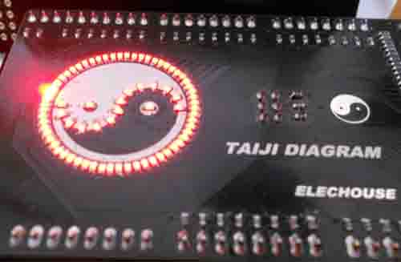

##TAJIUINO DUE##

[Taijiuino DUE](http://www.elechouse.com/elechouse/index.php?main_page=product_info&cPath=72_73&products_id=2214) is an Arduino-like board derives from [Arduino DUE](http://arduino.cc/en/Main/ArduinoBoardDue), it is designed by [Elechouse](http://www.elechouse.com).

[MORE INFORMATION](http://www.elechouse.com/elechouse/index.php?main_page=product_info&cPath=72_73&products_id=2214) 

### Details ###

##### Hardware #####
Schematic and Gerber files of Taiji-Uino board.

##### Software #####
Sample code to demonstrate how to use Arduino DUE

- **rtled** turn on *LEDRX* and turn off *LEDTX* for 0.5 second, then turn off *LEDRX* and turn on *LEDTX* for 0.5 second, repeatedly.
- **taijidiagram** Demonstrate how to make **Native USB** as a serial port, this program controls all the GPIOs to turn on or turn off the LEDs which are connected to the GPIO, work together with TaijiDiagram, is used to test the TaijiUino Due, a bit like this:

	

### Get files ###

    # get through GIT tools
    git clone https://github.com/elechouse/TAIJI-UINO.git
or

	# download the zip file

### Buy a board ###

[On Ebay](http://www.ebay.com/itm/TAIJIUINO-Due-Pro-Board-with-Programmer-completely-compatible-with-Arduino-Due-/140903497573?pt=LH_DefaultDomain_0&hash=item20ce80bf65) or [On Elechouse website](http://www.elechouse.com/elechouse/index.php?main_page=product_info&cPath=72_73&products_id=2214)